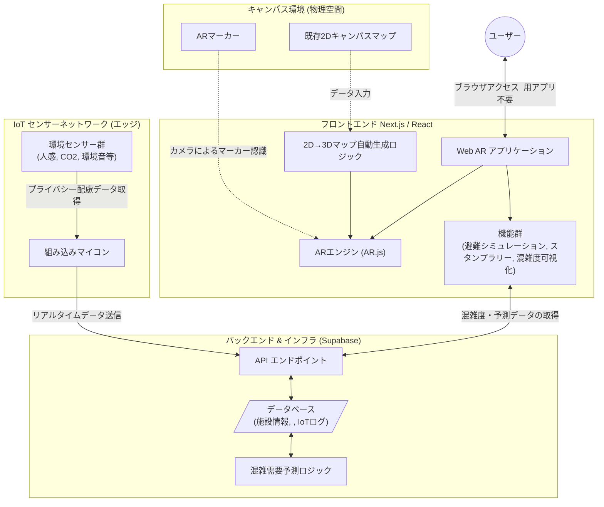

# システムアーキテクチャ図

`docs/requirements.md` および `docs/specifications.md` に基づく、Web ARアプリケーションとIoTセンサーネットワークを統合したシステムのアーキテクチャ図です。

## 各コンポーネントの役割

* **フロントエンド (Next.js / React)**:
  * ユーザーはブラウザからアクセスし、専用アプリ不要でAR機能を利用します。
  * `AR.js` を用いて、キャンパス内のARマーカーを認識し、3Dオブジェクトを描画します。
  * 既存の2Dマップから3Dマップを自動生成するロジックにより、空間認識の補助を行います。
* **バックエンド (Supabase)**:
  * IoTネットワークから送信されるセンサーデータを受け取り、蓄積します。
  * 蓄積されたデータに基づき、食堂や自習室などの混雑状況を予測するアルゴリズムを実行します。
  * フロントエンドに対して、リアルタイムの混雑状況や予測データをAPI経由で提供します。
* **IoTセンサーネットワーク**:
  * 学内各所に設置され、プライバシーに配慮したデータ（人感、CO2、音など）を収集します。
  * 組み込みマイコンを通じて、バックエンド（Supabase）へデータを送信します。
